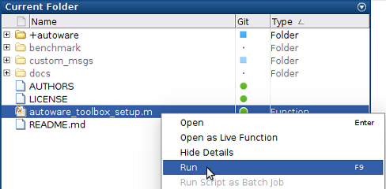
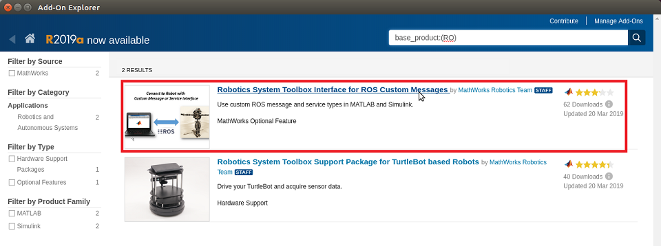
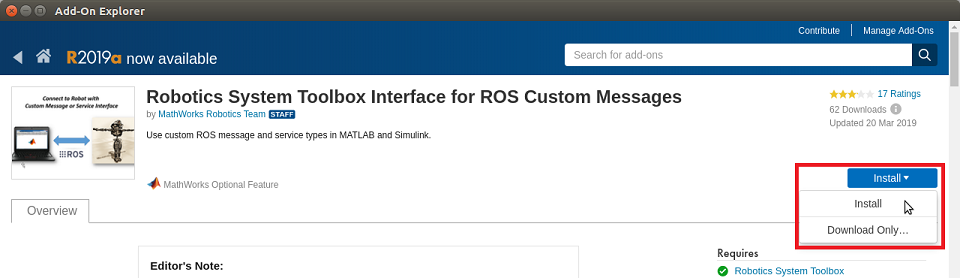
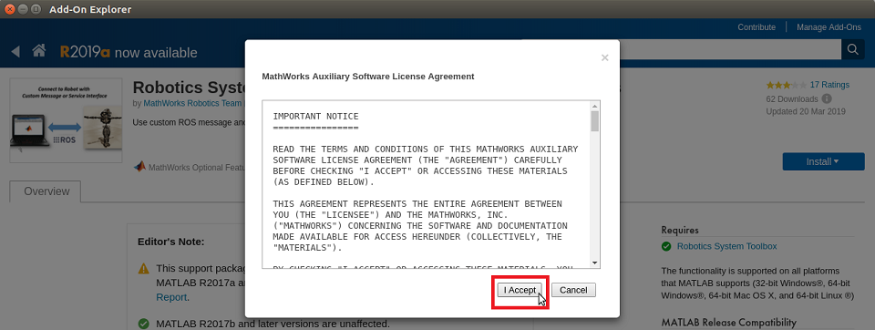
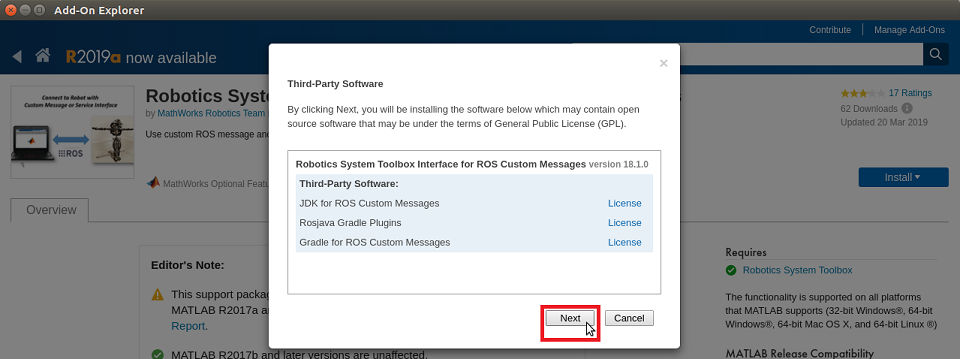
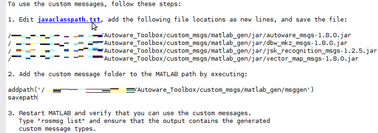
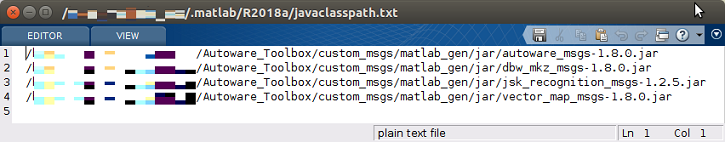
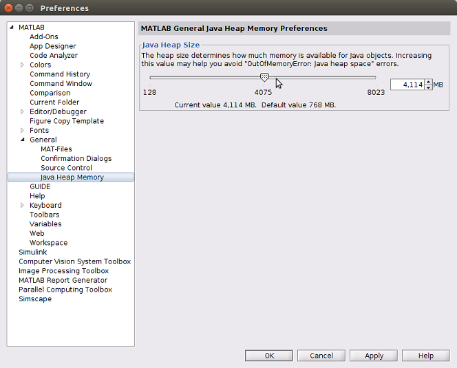
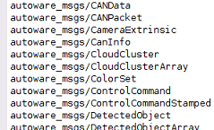

# Install Autoware Toolbox in MATLAB

## 1. Download from GitHub
Download the Autoware Toolbox from the [GitHub repository](https://github.com/CPFL/Autoware_Toolbox).

## 2. Add Autoware Toolbox folder to MATLAB search path
Run autoware_toolbox_setup.m in the root folder of Autoware Toolbox.  
  

## 3. Install Robotics System Toolbox Interface for ROS Custom Messages
###  a. Confirm if add-on is installed.
Paste the following program into the MATLAB command window and execute it.
```MATLAB
addons = matlab.addons.installedAddons;
addon_id = 'RO_CUSTOM_ROS_INTERFACE';
tf = strcmp(addon_id, addons.Identifier);
installed_ros_if = any(tf);
if installed_ros_if
   disp('Robotics System Toolbox Interface for ROS Custom Messages is already installed.');
else
   disp('Robotics System Toolbox interface for ROS Custom Messages is not installed.');
end
```

### b. Install Robotics System Toolbox Interface for ROS Custom Messages
**※If already installed, this work is not necessary. Skip to "4. Create ROS custom message".**

To install the add-ons relevant to Robotics System Toolbox, enter the following command in the MATLAB command window and execute.  
```MATLAB
roboticsAddons();
``` 

When the Add-On Explorer opens, select Robotics System Toolbox Interface for ROS Custom Messages.  


Click "Install" button.  


Click "I Accept" button.  


When the third-party software installation screen appears, click Next.  


Continue to follow the setup instructions on the Add-On Explorer to install add-ons.  

#### Reference
1.[Install Robotics System Toolbox Add-ons （MathWorks Website）](https://www.mathworks.com/help/releases/R2018a/robotics/ug/install-robotics-system-toolbox-support-packages.html)
 
## 4. Create Custom Messages from ROS Package
### a. Run a custom message generation program.  
Paste the following command into the MATLAB command window and execute it.  
``` MATLAB
autoware.createCustomMessages();    
```  
### b. Edit javaclasspath.txt  
Follow the steps below or execute `autoware.editJavaClassPath ()`.  

1. Click the javaclasspath.txt link to open the file in the Editor.  

1. Copy and paste the different jar file locations as new lines in the file. If this file does not exist, you will be prompted to create it. Click Yes and then copy and paste the file locations into the file.  
1. The javaclasspath.txt looks like this after adding lines. Other paths may also already exist in this file.  
 

### c. Add custom message folders to the MATLAB search path
Paste the following command into the MATLAB command window and execute it.  
```MATLAB
autoware.addCustomMessageFolderToSearchPath();
```
#### Reference
1.[Create Custom Messages from ROS Package （MathWorks Website）](https://www.mathworks.com/help/releases/R2018a/robotics/ug/create-custom-messages-from-ros-package.html)

## 5. Adjust  the Java heap size
Autoware may send and receive large ROS messages.
Therefore, increase the Java heap memory size.  

1. Click __Preferences__ on the MATLAB toolbar.
1. Expand General
1. To open the MATLAB __General__ Java Heap Memory Preferences panel, click __Java Heap Memory__

1. Adjust the Java heap memory size.
1. Click the "OK" button to close the dialog box.
1. To enable the new Java heap size, restart MATLAB.

#### Reference  
1. [Java Memory Usage （MathWorks Website）](https://www.mathworks.com/help/releases/R2018a/rptgen/ug/java-memory-usage.html)  
1. [Java Heap Memory Preferences （MathWorks Website）](https://www.mathworks.com/help/releases/R2018a/matlab/matlab_external/java-heap-memory-preferences.html)  

## 6. Restart MATLAB  
1. Restart MATLAB for the new Java heap size and path changes to be applied.  
1. After restarting MATLAB, verify the Autoware messages are registered.    
```MATLAB
rosmsg list
```  

If the Autoware messages are registered, the installation is complete.   



---
## Demo Video
[](https://youtu.be/585bJhutSYc)