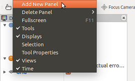
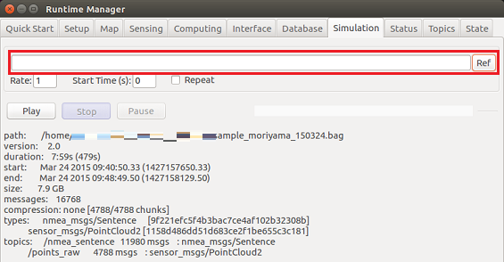
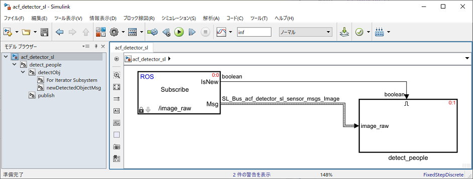

# Usage example of acf_detector_sl.slx

## 1. Run Autoware
Run Autoware.  
  

The Runtime Manager window is launched.  
  

## 2. Launch rviz
Launch the rviz by clicking the RViz button on the Runtime Manager.  
  

## 3. Show imageViewerPlugin
When rviz starts, select ［Panels］-［Add New Panel］ from the menu.  
  

Select "imageViewerPlugin".  
  

Adjust the size of the imageViewerPlugin screen.  
For example, make the imageViewerPlugin screen float as follows.  
  

Then adjust the screen size.  
  

## 4. Setting of rosbag file to play video
Open the Simulation tab of the Runtime Manager.  
Click the "Ref" button to set the rosbag file to play.  
  

## 5. Connect MATLAB to Autoware (ROS Master)
Connect to the ROS master using the rosinit command in MATLAB.  
Set the rosinit arguments according to your environment.  
```MATLAB
rosinit();
``` 

## 6. Open ACF Detector（acf_detector_sl.slx） created in Simulink.
Add the folder containing the acf_detector_sl.slx file to MATLAB search path, 
open the ACF Detector Simulink model.  
```MATLAB
acf_detector_sl_folder = fullfile(autoware.getRootDirectory(), ...
                        'benchmark', 'computing', 'perception', ...
                        'detection', 'vision_detector', 'acf_detector');
addpath(acf_detector_sl_folder);
model = 'acf_detector_sl';
open_system(model);
```  

  
 
## 7. Run ACF Detector created in Simulink
Run the Simulink model.  
```MATLAB
set_param(model, 'SimulationCommand', 'Start');
```

## 8. Play rosbag file
Open the Simulation tab of the Runtime Manager.  
Click the "Play" button to play rosbag.  
  

## 9. Topic setting of imageViewerPlugin  
1. Set the Image Topic of ImageViewerPlugin to "/image_raw".
1. Set Object Rect Topic of imageViewerPlugin to "/detection/vision_objects".
1. When a person is detected, the Boundary Box is displayed.    
  

The above figure uses the sample data provided in
[this book](http://www.ric.co.jp/book/contents/book_1187.html).  

Click
[here](images/AcfDetector/rosgraph_acf_detector_sl.png) to check the node graph when this 
example is executed.  
The node generated by acf_detctor_sl.slx is "/acf_detector_sl_81473".


## 10. Clean up
Execute the following command to finish.    
```MATLAB
set_param(model, 'SimulationCommand', 'Stop');
close_system(model);
rosshutdown();
rmpath(acf_detector_sl_folder);
clear('model', 'acf_detector_sl_folder');
```