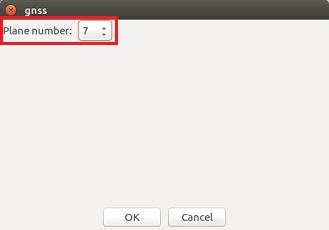
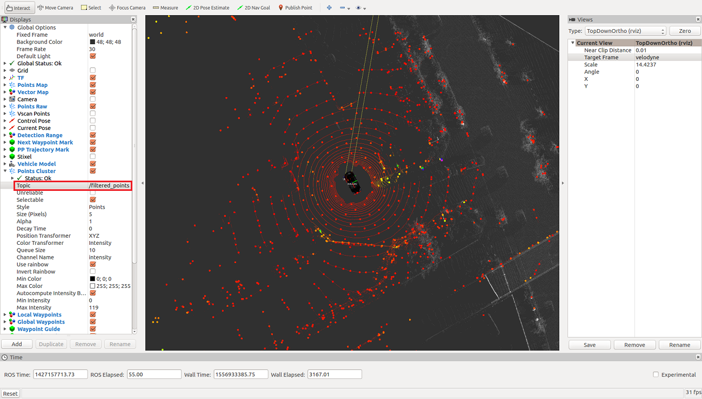

# Usage example of VoxelGridFilter.m
 
## 1. Run Autoware
Run Autoware to launch the ROS master.  
  

The Runtime Manager window is launched.  


## 2. Simulation clock setting
Open the Simulation tab of the Runtime Manager.
Click the "Ref" button to set the rosbag file to play.  
  

Click the "Play" button to play rosbag (①), then click the "Pause" button to pause it (②).
This operation turns on the simulation clock.  


## 3. LiDAR mounting position setting and load vehicle model
Open the Setup tab of the Runtime Manager.
Select Velodyne in the localizer section.  


Set the parameters of the Baselink to Localizer section as follows, and click the "TF" button.  


Load the vehicle model by clicking the "Vehicle Model" button in the Vehicle Model section.
If you leave the file selection blank, the default car model is loaded.  


## 4. Loading of map data and TF
Open the Map tab of the Runtime Manager.  

1. Click the "Ref" button to the right of the "Point Cloud" button, select all pcd files to use for localization, and click the "Point Cloud" button.  
2. Click the "Ref" button on the right of the "TF" button, select the launch file with the TF information corresponding to the pcd data, and click the "TF" button.


## 5. Start nodes required to run this example
Open the Computing tab of the Runtime Manager.  
Click the app of *nmea2tfpose* to open the setting window, set the Plane number to "7", and click the "OK" button.  


Click the *ndt_matching* app to open the setting window, select "GNSS", and click the "OK" button.  


Check the checkboxes of *nmea2tfpose* and *ndt_matching* .  


## 6. Connect MATLAB to Autoware (ROS Master)
Connect to the ROS master using the rosinit command in MATLAB.  
```MATLAB
rosinit();
```
## 7. Start VoxelGridFilter.m
 Add the folder containing the VoxelGridFilter.m class file to MATLAB search path, create an instance of voxelGridFilter, and execute filtering.  
```MATLAB
voxel_grid_filter_folder = fullfile(autoware.getRootDirectory(), ...
                                    'benchmark', 'sensing', 'filters', 'points_downsampler', ...
                                    'voxel_grid_filter');
addpath(voxel_grid_filter_folder);
voxel_grid_filter_obj = VoxelGridFilter();
```

## 8. Play rosbag file
Open the Simulation tab of the Runtime Manager.
Click the "Pause" button to play rosbag.  


## 9. Launch rviz
Launch the rviz by clicking the RViz button on the Runtime Manager.    


When rviz starts, select "Autoware / ros / src / .config / rviz / default.rviz" from the [File]-[Open Config] menu.
The data loaded by Runtime Manager and rosbag data are displayed.  


## 10. Checking filter processing
Set the topic of the point cluster to "/ points_raw" and check the point cloud before filtering.  


Next, change the topic of Points Cluster to "/ filtered_points" and check the filtered point cloud.  


You can confirm that it is downsampled.

Click
[here](images/voxel_grid_filter_ml/rosgraph_voxel_grid_filter_ml.png) to check the node graph image when executing this example, or click
[here](images/voxel_grid_filter_ml/rosgraph_voxel_grid_filter_ml.svg) to check the SVG file.
The node generated by VoxelGridFilter.m is / voxel_grid_filter_ml.

## 11. Clean up
Execute the following command to finish.  
```MATLAB
voxel_grid_filter_obj.delete()
rosshutdown();
rmpath(voxel_grid_filter_folder);
clear voxel_grid_filter_obj voxel_grid_filter_folder;
```