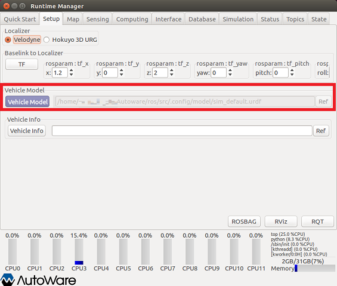
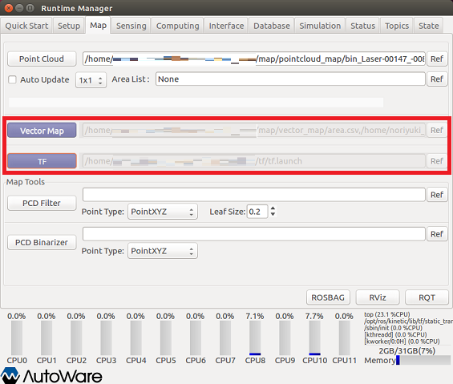
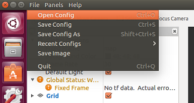
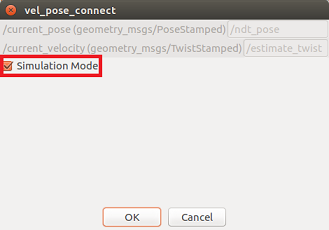
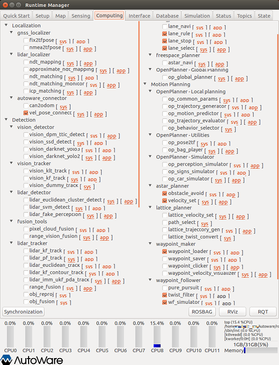
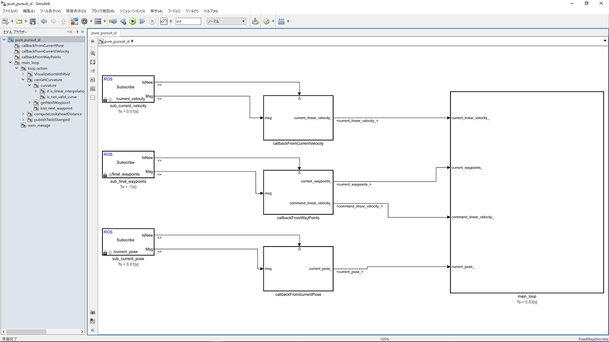
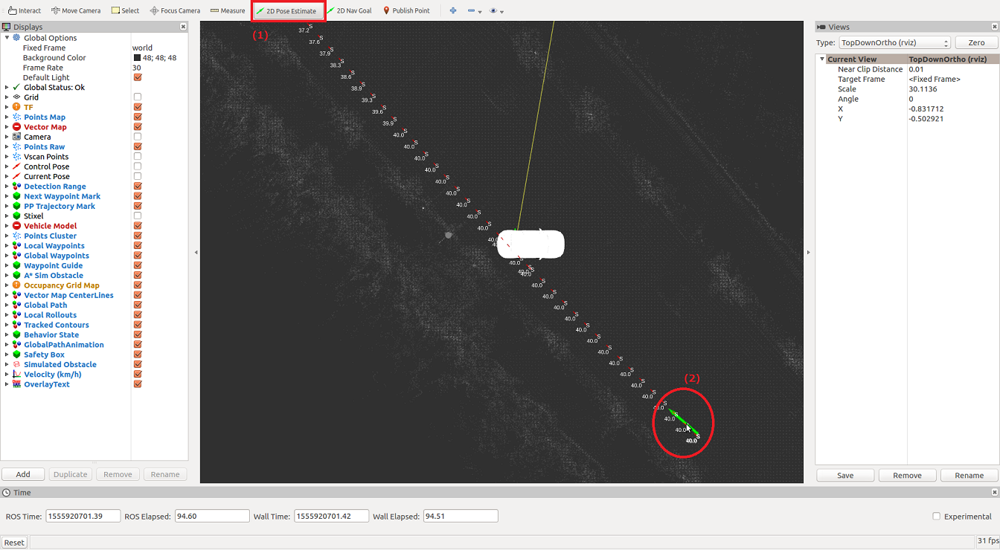

# Usage example of pure_pursuit_sl.slx
## 1. Run Autoware
Run Autoware to launch the ROS master.    
  

The Runtime Manager window is launched.  
  

## 2. Load vehicle model
Open the Setup tab of the Runtime Manager. Load a vehicle model.  
  

## 3. Load vector map and TF
Open the Map tab of the Runtime Manager. Load Vector Map and TF.  
  

## 4. Launch rviz
Launch the rviz by clicking the RViz button on the Runtime Manager.  
  

When rviz starts, select [File]-[Open Config] from the menu.  


Select " ~/ Autoware / ros / src / .config / rviz / default.rviz" on the file dialog.  


After Config setting, Vector Map is displayed on the rviz screen.  


## 5. Settings on the Runtime Manager's Computing tab
(1) Click "app" of *waypoint_loader* and select the csv file where the route is stored.  
  
After selecting the csv file, check the *waypoint_loader* checkbox.  

(2) Click "app" of *vel_pose_connect* and check "Simulation Mode".  
  
After setting the "Simulation Mode", check the *vel_pose_connect* checkbox.    

(3) Click "app" of *wf_simulator* and set "Initialize Source" to "Rviz".  
  
After setting the "Initialize Source", check the *wf_simulator* checkbox.

(4) Check the checkboxes for lane_rule, lane_stop, lane_select, obstacle_avoid, velocity_set, twist_filter and wf_simulator. After setting, the Computing tab is as shown below.  


## 6. Connect MATLAB to Autoware (ROS Master)
Connect to the ROS master using the rosinit command in MATLAB.
Set the rosinit arguments according to your environment.  
```MATLAB
rosinit();
```  


## 7. Open pure_pursuit created in Simulink.
Add the folder containing the pure_pursuit_sl.slx file to MATLAB search path, 
open the pure_pursuit Simulink model.  
```MATLAB
pure_pursuit_folder = fullfile(autoware.getRootDirectory(), ...  
                        'benchmark', 'computing', 'planning', 'motion', 'waypoint_follower', ... 
                        'pure_pursuit');
addpath(pure_pursuit_folder);
model = 'pure_pursuit_sl';
open_system(model);
```  

 
## 8. Run pure_pursuit created in Simulink
Run the Simulink model.  
```MATLAB
set_param(model, 'SimulationCommand', 'Start');
```

## 9. Set the initial position of the vehicle with rviz
 (1) Click "2D Pose Estimate" of rviz.  
 (2) Next, drag the mouse in the direction of movement from the initial position of the vehicle.



<html><br></html>

## 10. Start path following
After a while after setting the initial position with rviz, path following starts.  


Click 
[here](./images/pure_pursuit/rosgraph_pure_pursuit.png) to check the node graph when this example is executed.
The node generated by pure_pursuit_sl is / pure_pursuit_sl_81473.

## 11. Clean up
Execute the following command to finish.  
```MATLAB
set_param(model, 'SimulationCommand', 'Stop');
close_system(model);
rosshutdown();
rmpath(pure_pursuit_folder);
clear('model', 'pure_pursuit_folder');
```
---
## Demo Video
[](https://youtu.be/C1ay6RXpXGo)