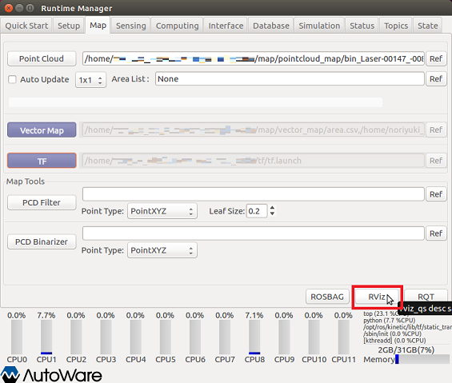

# Usage example of WfSimulator.m

## 1. Run Autoware
Run Autoware to launch the ROS master.    
  

The Runtime Manager window is launched.  
  

## 2. Load vehicle model
Open the Setup tab of the Runtime Manager. Load a vehicle model.  
  

## 3. Load vector map and TF
Open the Map tab of the Runtime Manager. Load Vector Map and TF.  
  

## 4. Launch rviz
Launch the rviz by clicking the RViz button on the Runtime Manager.  
  

When rviz starts, select [File]-[Open Config] from the menu.  


Select " ~/ Autoware / ros / src / .config / rviz / default.rviz" on the file dialog.  


After Config setting, Vector Map is displayed on the rviz screen.  


## 5. Settings on the Runtime Manager's Computing tab
(1) Click "app" of *waypoint_loader* and select the csv file where the route is stored.  
  
After selecting the csv file, check the *waypoint_loader* checkbox.  

(2) Click "app" of *vel_pose_connect* and check "Simulation Mode".  
  
After setting the "Simulation Mode", check the *vel_pose_connect* checkbox.    

(3) Click "app" of *wf_simulator* and set "Initialize Source" to "Rviz".  
  
After setting the "Initialize Source", check the *wf_simulator* checkbox.

(4) Check the checkboxes for lane_rule, lane_stop, lane_select, obstacle_avoid, velocity_set, pure_pursuit and twist_filter. After setting, the Computing tab is as shown below.  


## 6. Connect MATLAB to Autoware (ROS Master)
Connect to the ROS master using the rosinit command in MATLAB.
Set the rosinit arguments according to your environment.  
```MATLAB
rosinit();
```  


## 7. Start WfSimulator.m.
Add the folder containing the WfSimulator.m class file to MATLAB search path, 
create an instance of WfSimulator, and execute.  
```MATLAB
wf_sim_folder = fullfile(autoware.getRootDirectory(), ...
                        'benchmark', 'computing', 'planning', 'motion', 'waypoint_follower', 'wf_simulator');
addpath(wf_sim_folder);
wf_simulator_ml_obj = WfSimulator();
wf_simulator_ml_obj.run();
```  

 
## 8. Set the initial position of the vehicle with rviz
 (1) Click "2D Pose Estimate" of rviz.  
 (2) Next, drag the mouse in the direction of movement from the initial position of the vehicle.  


## 9. Start path following
After a while after setting the initial position with rviz, path following starts.  


Click 
[here](./images/wf_simulator/rosgraph.png) to check the node graph when this example is executed.
The node generated by WfSimulator.m is "/wf_simulator_ml".  

## 10. Clean up
Execute the following command to finish.  
```MATLAB
wf_simulator_ml_obj.delete()
clear wf_simulator_ml_obj;
rosshutdown();
rmpath(wf_sim_folder);
```