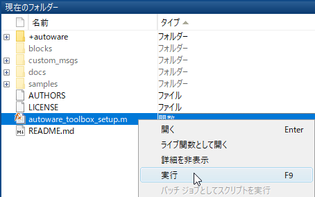
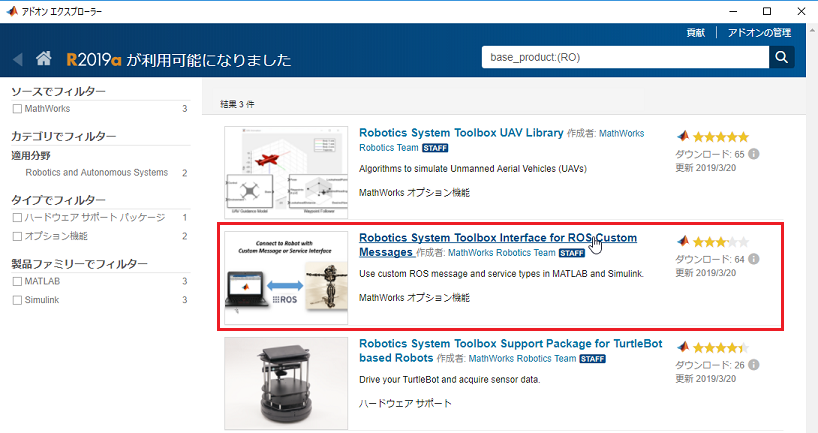
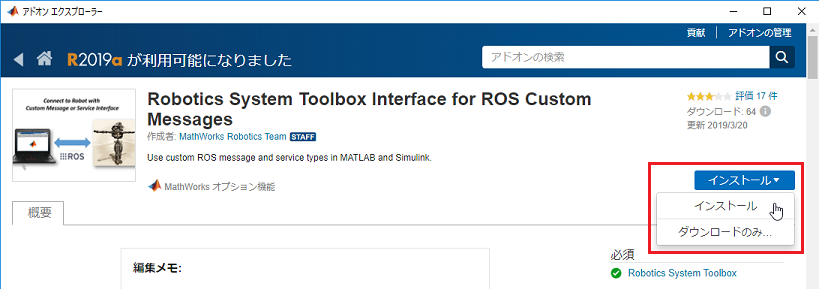
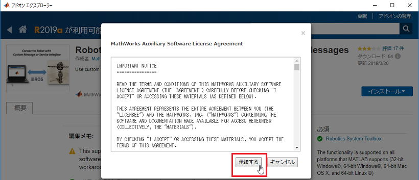
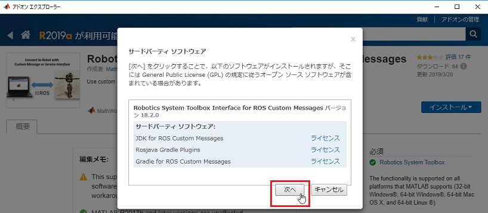
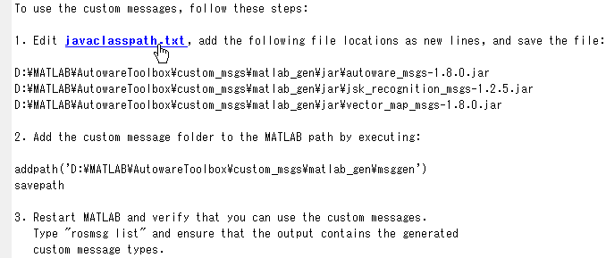
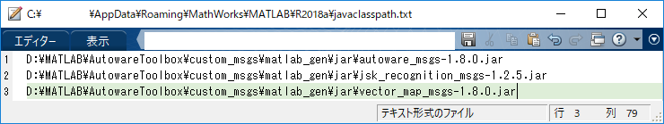
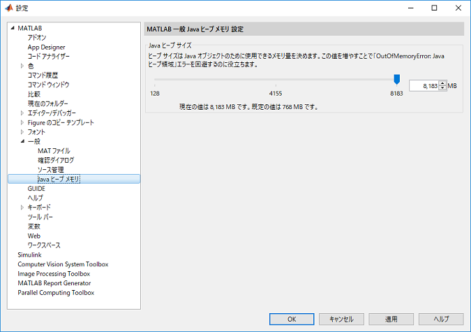
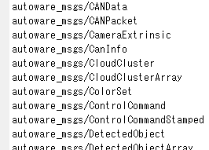

# Autoware Toolbox のインストール
MATLAB で Autoware Toolbox を利用するための手順を説明します。

## 1. Autoware Toolbox のダウンロード
 [GitHub にある Autoware Toolbox のリポジトリ](https://github.com/CPFL/Autoware_Toolbox)をローカルにクローン（またはダウンロード）します。

## 2. Autoware Toolbox を MATLAB 検索パスに登録
Autoware Toolbox のルートフォルダにある autoware_toolbox_setup.m を実行します。  
  

## 3. Robotics System Toolbox Interface for ROS Custom Messages のインストール
###  a. インストール済みか確認します。
 下記のプログラムをMATLAB コマンドウィンドウに貼り付けて実行してください。  
```MATLAB
addons = matlab.addons.installedAddons;
addon_id = 'RO_CUSTOM_ROS_INTERFACE';
tf = strcmp(addon_id, addons.Identifier);
installed_ros_if = any(tf);
if installed_ros_if
   disp('Robotics System Toolbox Interface for ROS Custom Messages がインストールされています。');
else
   disp('Robotics System Toolbox Interface for ROS Custom Messages がインストールされていません。');
end
```

上記プログラムを実行すると、インストール済みの場合は、MATLAB コマンドウィンドウに「Robotics System Toolbox Interface for ROS Custom Messages がインストールされています。」 と表示されます。  
 
  
 インストールされていない場合は、MATLAB コマンドウィンドウに「Robotics System Toolbox Interface for ROS Custom Messages がインストールされていません。」 と表示されます。  

  
### b. Robotics System Toolbox Interface for ROS Custom Messages のインストール
**※インストール済みの場合は、本作業は不要です。**

Robotics System Toolbox に関連するアドオンをインストールするには、以下のコマンドを MATLAB コマンドウィンドウに入力して実行します。  
```MATLAB
roboticsAddons();
``` 
  
アドオン エクスプローラが開いたら、Robotics System Toolbox Interface for ROS Custom Messages を選択します。  

  
［インストール］をクリックします。  

  
［アドオン エクスプローラー］のセットアップ指示に引き続き従い、アドオンをインストールします。［承諾する］をクリックします。  

  
サードパーティ ソフトウェアの画面が出てきたら、［次へ］をクリックします。  


#### 参考
1.[Install Robotics System Toolbox Add-ons （MathWorks Webサイト）](https://www.mathworks.com/help/releases/R2018a/robotics/ug/install-robotics-system-toolbox-support-packages.html)
 
## 4. ROS カスタムメッセージの作成
### a. カスタム メッセージ生成プログラムを実行します。
下記のコマンドを MATLAB コマンドウィンドウに貼り付けて実行してください。  
``` MATLAB
autoware.createCustomMessages();    
```
### b. javaclasspath.txt を編集します。
以下の手順に従うか、`autoware.editJavaClassPath()`を実行します。

コマンドウィンドウの javaclasspath.txt リンクをクリックして、このファイルをエディターで開きます。
コマンドウィンドウに表示されている jar ファイルの場所をコピーし、それぞれ新しい行としてこのファイルに貼り付けます。
このファイルが存在しない場合、作成を求めるプロンプトが表示されます。
［はい］ をクリックしてから、ファイルの場所をコピーしてこのファイルに貼り付けます。  

  
行を追加した後の javaclasspath.txt は次のようになります。このファイルには既に他のパスが存在している場合もあります。    
 
  
### c. カスタムメッセージのフォルダを MATLAB 検索パスに追加します。
下記のコマンドを MATLAB コマンドウィンドウに貼り付けて実行してください。  
```MATLAB
autoware.addCustomMessageFolderToSearchPath();
```
#### 参考
1.[Create Custom Messages from ROS Package （MathWorks Webサイト）](https://www.mathworks.com/help/releases/R2018a/robotics/ug/create-custom-messages-from-ros-package.html)

## 5. Java ヒープメモリサイズの設定
Autowareでは、サイズが大きいROSメッセージを送受信することがあります。そこで、Java ヒープメモリサイズを増やしておきます。
［設定］ダイアログボックスを開き、Java ヒープメモリサイズを調整します。調整後、［OK］ボタンをクリックして、［設定］ダイアログボックスを閉じます。  


## 6. MATLAB の再起動
MATLAB を再起動後、Autoware メッセージが登録されているか確認します。  
```MATLAB
rosmsg list
```
Autoware メッセージが登録されていれば、インストールは終了です。 


