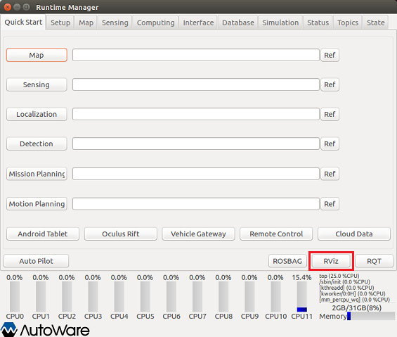
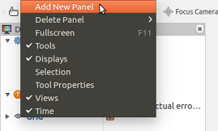
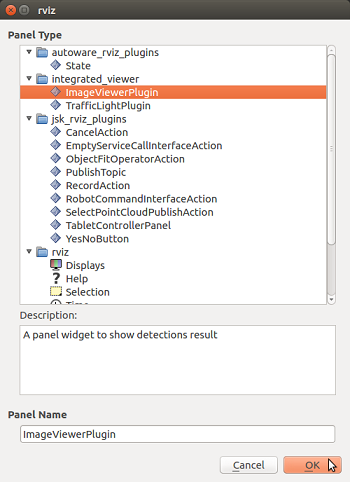
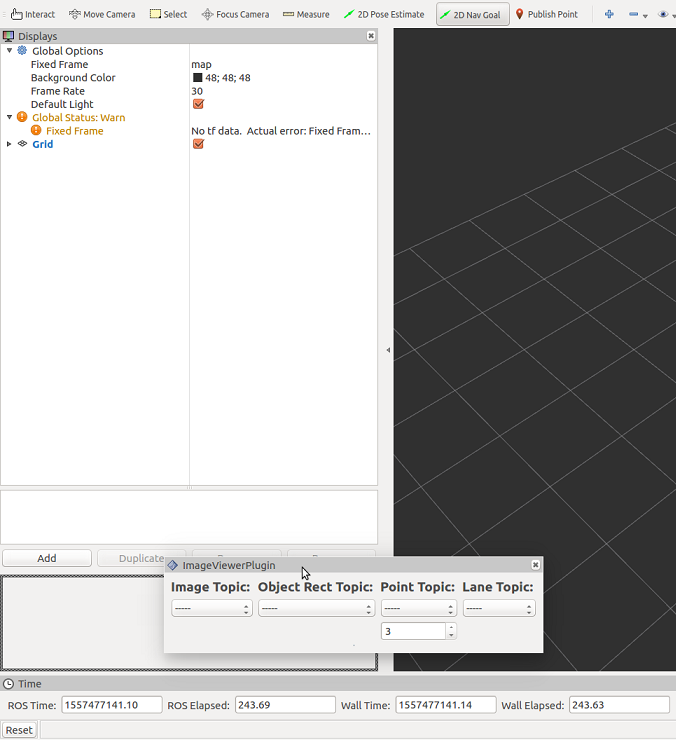
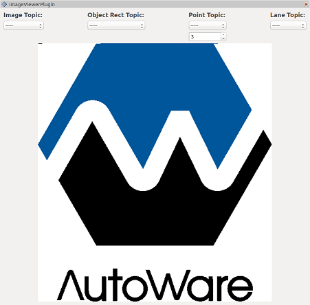
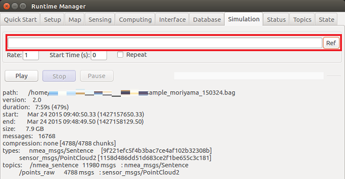
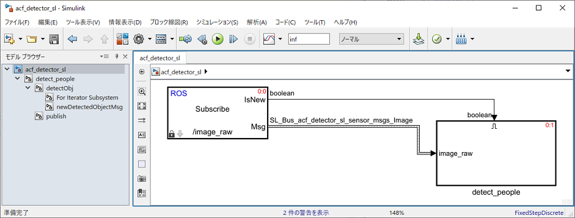
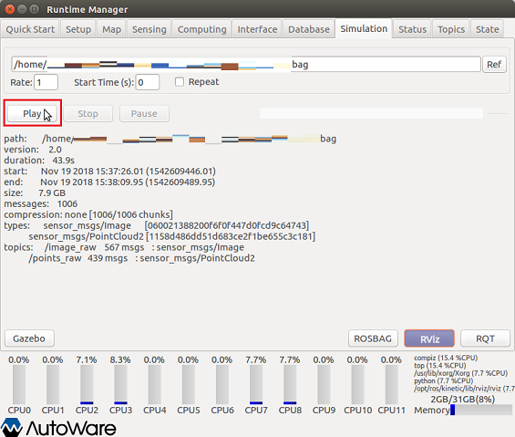
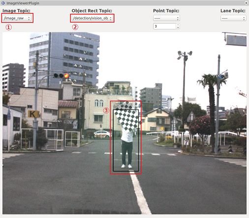

# acf_detector_sl.slx の利用例

## 1. Autoware の起動
Autoware を実行して ROS マスターを起動します。  
  

Runtime Manager が立ち上がります。  
  

## 2. rviz の起動
Runtime Manager の RViz ボタンをクリックして rviz を起動します。  
  

## 3. imageViewerPlugin の表示
rviz が起動したら、メニューの［Panels］-［Add New Panel］を選択します。  
  

起動した画面で「imageViewerPlugin」を選択します。  
  

imageViewerPlugin 画面のサイズを調整します。
例えば、下図のように imageViewerPlugin 画面をフローティング状態にします。  
  

その後、画面サイズを調整します。  
  

## 4. 動画再生する rosbag ファイルの設定
Runtime Manager の Simulation タブを開きます。
「Ref」ボタンをクリックして、再生する rosbag ファイルを設定します。  
  

## 5. MATLAB から Autoware（ROS マスター）への接続
MATLAB で rosinit コマンドを使用して ROS マスターに接続します。
rosinit の引数はご自身の環境に合わせて設定してください。
```MATLAB
rosinit();
``` 

## 6. Simulink で作成した ACF Detector（acf_detector_sl.slx）を起動
ACF Detector の Simulink モデル（acf_detector_sl.slx）があるフォルダを MATLAB 検索パスに登録後、
Simulink モデルを開きます。
```MATLAB
acf_detector_sl_folder = fullfile(autoware.getRootDirectory(), ...
                        'benchmark', 'computing', 'perception', ...
                        'detection', 'vision_detector', 'acf_detector');
addpath(acf_detector_sl_folder);
model = 'acf_detector_sl';
open_system(model);
```  

  
 
## 7. Simulink で作成した ACF Detector を実行
ACF Detector の Simulink モデルを実行します。
```MATLAB
set_param(model, 'SimulationCommand', 'Start');
```

## 8. rosbag の再生（Runtime Manager の Simulation タブ）

「Play」ボタンをクリックしてrosbag を再生します。  
  

## 9. imageViewerPlugin の Topic 設定  
1. imageViewerPlugin の Image Topic を「/image_raw」に設定します。
1. imageViewerPlugin の Object Rect Topic を「/detection/vision_objects」に設定します。
1. 人物を検出すると Boundary Box が表示されます。  
  

上図は、書籍「[自動運転ソフトウェア入門 Autoware](http://www.ric.co.jp/book/contents/book_1187.html)」で提供されるサンプルデータを利用しています。  
本サンプル実行時のノードグラフを表示するには、
[ここ](images/AcfDetector/rosgraph_acf_detector_sl.png) をクリックしてください。  
本例においては、acf_detector_sl.slx で生成されたノードは /acf_detector_sl_81473 です。

## 10. 終了処理
下記のコマンドを実行して終了します。  
```MATLAB
set_param(model, 'SimulationCommand', 'Stop');
close_system(model);
rosshutdown();
rmpath(acf_detector_sl_folder);
clear('model', 'acf_detector_sl_folder');
```