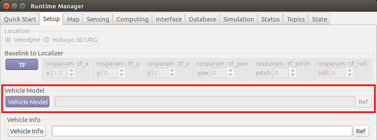

# VoxelGridFilter.m の利用例
 
## 1. Autoware の起動
Autoware を実行して ROS マスターを起動します。  
  

Runtime Manager が立ち上がります。  


## 2. シミュレーションクロックの設定（Runtime Manager の Simulation タブ）
Runtime Manager の Simulation タブを開きます。  
「Ref」ボタンをクリックして、再生する rosbag ファイルを設定します。  
  

「Play」ボタンをクリックしてrosbag を再生後（下図①）、「Pause」ボタンをクリックし一時停止させます（下図②）。
これによりシミュレーションクロックがオンになります。  


## 3. LiDAR 位置設置と車両モデルのロード（Runtime Manager の Setup タブ）
Runtime Manager の Setup タブを開きます。  
Localizer部 で Velodyne を選択します。


Baselink to Localizer 部のパラメータを以下のように設定し、「TF」ボタンをクリックします。  


Vehicle Model 部の「Vehicle Model」ボタンをクリックして、車両モデルをロードします。  
ファイル選択部を空欄にしておくことで、デフォルトの車両モデルがロードされます。


## 4. 地図データとTFのロード（Runtime Manager の Map タブ）
Runtime Manager の Map タブを開きます。  

1. 「Point Cloud」ボタンの右側の「Ref」ボタンをクリックして、自己位置推定に使用する pcd ファイルを全て選択し、「Point Cloud」ボタンをクリックします。  
2. 「TF」ボタンの右側「Ref」ボタンをクリックして、pcd データに対応する TF 情報が設定された launch ファイルを選択し、「TF」ボタンをクリックします。


## 5. 動作確認に必要なノードを起動（Runtime Manager の Computing タブ）
Runtime Manager の Computing タブを開きます。  
nmea2tfpose の app をクリックして設定画面を開き、Plane number を「7」に設定後、「OK」ボタンをクリックします。  


ndt_matching の app をクリックして設定画面を開き、「GNSS」を選択後、「OK」ボタンをクリックします。  


nmea2tfpose と ndt_matching のチェックボックスにチェックを入れます。  


## 6. MATLAB から Autoware（ROS マスター）への接続
MATLAB で rosinit コマンドを使用して ROS マスターに接続します。  
```MATLAB
rosinit('http://169.254.66.185:11311');
```
## 7. VoxelGridFilter.m の起動
VoxelGridFilter.m クラスファイルがあるフォルダを MATLAB 検索パスに登録後、
VoxelGridFilter のインスタンスを生成し、フィルタ処理を実行します。
```MATLAB
voxel_grid_filter_folder = fullfile(autoware.getRootDirectory(), ...
                                    'benchmark', 'sensing', 'filters', 'points_downsampler', ...
                                    'voxel_grid_filter');
addpath(voxel_grid_filter_folder);
voxel_grid_filter_obj = VoxelGridFilter();
```

## 8. rosbag の再生（Runtime Manager の Simulation タブ）
「Pause」ボタンをクリックして、rosbag を再生します。  


## 9. rviz の起動
Runtime Manager の RViz ボタンをクリックして rviz を起動します。    


rviz が起動したら、メニューの［File］-［Open Config］から「Autoware/ros/src/.config/rviz/default.rviz」を選択します。
Runtime Manager でロードしたデータと rosbag のデータが表示されます。  


## 10. フィルタ処理の確認
rviz の Points Cluster の Topic を「/points_raw」に設定し、フィルタ処理前の点群を確認します。  


次に、Points Cluster の Topic を「/filtered_points」に設定変更し、フィルタ処理後の点群を確認します。  


ダウンサンプリングされていることが確認できます。

本例実行時のノードグラフ画像を確認するには
[ここ](images/voxel_grid_filter_ml/rosgraph_voxel_grid_filter_ml.png) を、
SVGファイルを確認するには
[ここ](images/voxel_grid_filter_ml/rosgraph_voxel_grid_filter_ml.svg) をクリックしてください。
VoxelGridFilter.m で生成されるノードは /voxel_grid_filter_ml です。

## 11. 終了処理
下記のコマンドを実行して終了します。  
```MATLAB
voxel_grid_filter_obj.delete()
rosshutdown();
rmpath(voxel_grid_filter_folder);
clear voxel_grid_filter_obj voxel_grid_filter_folder;
```