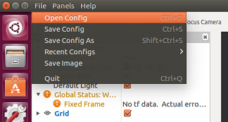
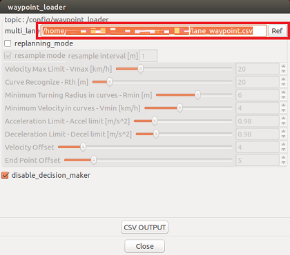
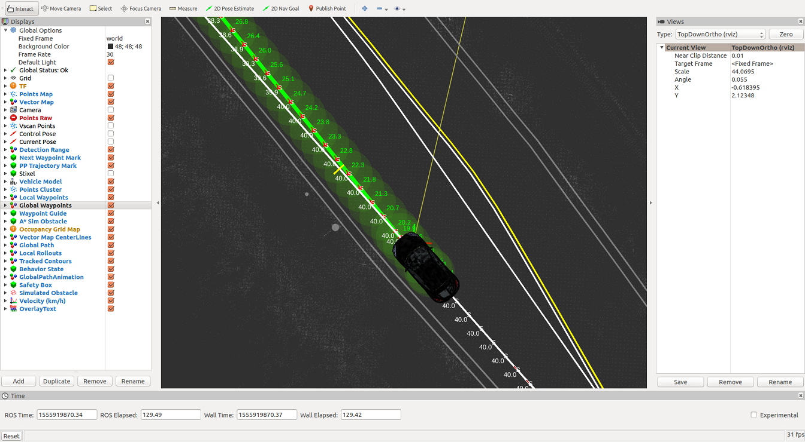

# VelPoseConnect.m の利用例
## 1. Autoware の起動
Autoware を実行して ROS マスターを起動します。  


Runtime Manager が立ち上がります。  


## 2. Runtime Manager の Setup タブ内の設定
車両モデルをロードします。  


## 3. Runtime Manager の Map タブ内の設定
Vector Map と TF を読み込みます。  


## 4. rviz の起動
Runtime Manager の RViz ボタンをクリックして rviz を起動します。  


rviz が起動したら、メニューから［File］-［Open Config］を選択します。  
  

ファイル選択画面で「~/Autoware/ros/src/.config/rviz/default.rviz」を選択します。  
  

Config 設定後、rviz 画面には Vector Map が表示されます。  


## 5. Runtime Manager の Computing タブ内の設定
(1) waypoint_loader の app をクリックして、経路が保存されている csv ファイルを指定します。  
  
ファイルを指定したら、Computing タブ内の waypoint_loader のチェックボックスにチェックを入れます。  

(2) vel_pose_connect の app をクリックして、「Simulation Mode」にチェックを入れます。
  
Simulation Mode 設定後、Computing タブ内の vel_pose_connect のチェックボックスにチェックを入れます。

(3) lane_rule、lane_stop、lane_select、obstacle_avoid、velocity_set、pure_pursuit、twist_filter の
チェックボックスにチェックを入れて、これらのノードを起動します。設定後の Computing タブは下図のようになります。  


## 6. MATLAB から Autoware（ROS マスター）への接続
MATLAB で rosinit コマンドを使用して ROS マスターに接続します。  
```MATLAB
rosinit();
```  


## 7. MATLAB で作成した wf_simulator を起動
WfSimulator クラスファイルがあるフォルダをMATLAB検索パスに登録後、WfSimulator クラスのインスタンスを生成し、run メソッドで実行します。  
```MATLAB
wf_sim_folder = fullfile(autoware.getRootDirectory(), ...
                        'benchmark', 'computing', 'planning', 'motion', 'waypoint_follower', 'wf_simulator');
addpath(wf_sim_folder);
wf_simulator_ml_obj = WfSimulator();
wf_simulator_ml_obj.run();
```  

 
## 8. rviz で車両の初期位置を設定
(1) rviz の「2D Pose Estimate」をクリックします。  
(2) その後、車両の初期位置から移動方向にマウスドラッグして矢印を設定します。  


## 9. 経路追従の開始
rviz で初期位置を設定後しばらくすると、経路追従が始まります。
  
本例実行時のノードグラフを確認するには
[ここ](images/wf_simulator/rosgraph.png)をクリックしてください。
WfSimulator.m で生成されるノードは /wf_simulator_ml です。

## 10. 終了処理

下記のコマンドを実行して終了します。  
```MATLAB
wf_simulator_ml_obj.delete()
clear wf_simulator_ml_obj;
rosshutdown();
rmpath(wf_sim_folder);
```