# pure_pursuit_sl.slx の利用例
## 1. Autoware の起動
Autoware を実行して ROS マスターを起動します。    
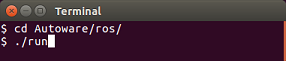  

Runtime Manager が立ち上がります。  
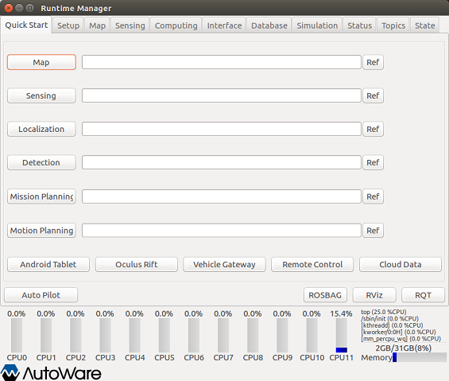  

## 2. Runtime Manager の Setup タブ内の設定
車両モデルをロードします。  
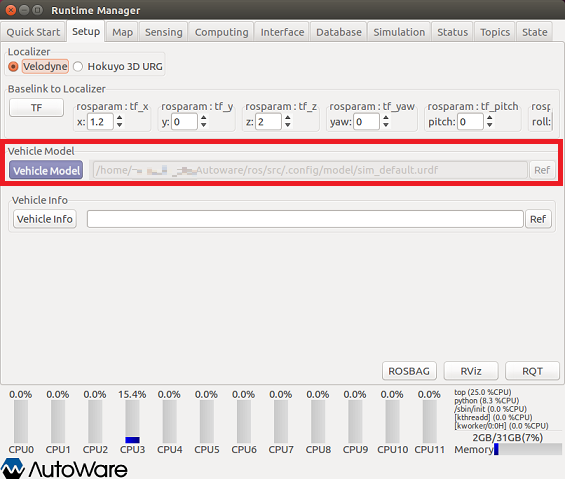  

## 3. Runtime Manager の Map タブ内の設定
Vector Map と TF を読み込みます。  
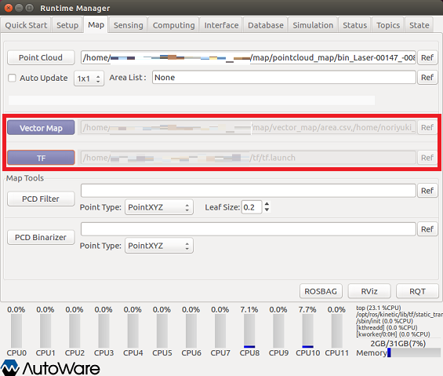  

## 4. rviz の起動
Runtime Manager の RViz ボタンをクリックして rviz を起動します。  
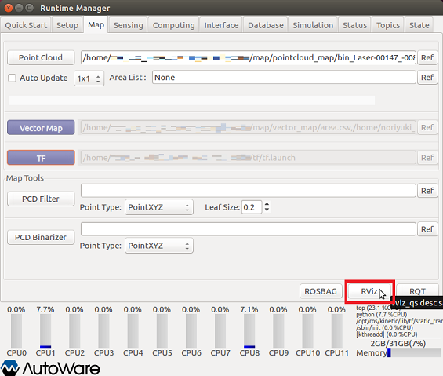  

rviz が起動したら、メニューから［File］-［Open Config］を選択します。  
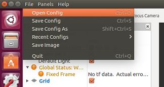

ファイル選択画面で「~/Autoware/ros/src/.config/rviz/default.rviz」を選択します。  
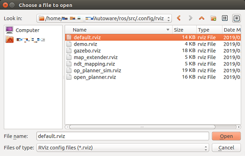

Config 設定後、rviz 画面には Vector Map が表示されます。  
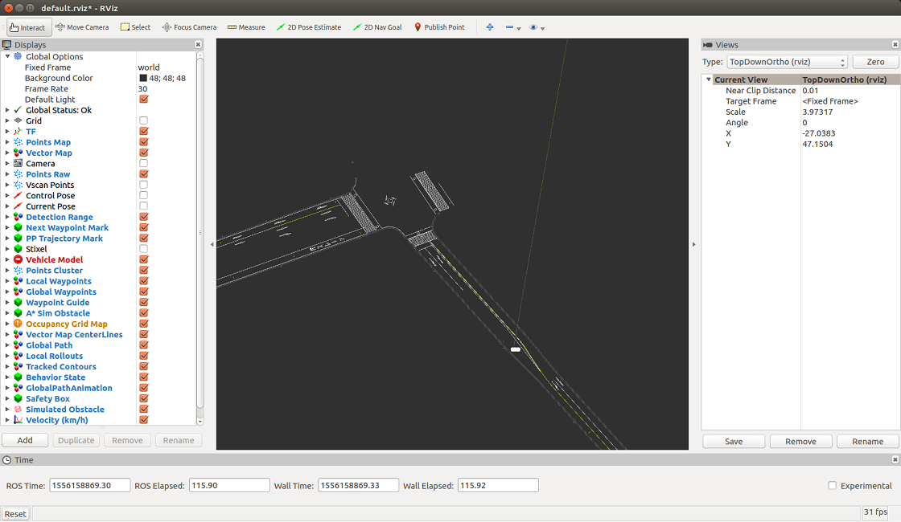

## 5. Runtime Manager の Computing タブ内の設定
(1) waypoint_loader の app をクリックして、経路が保存されている csv ファイルを指定します。  
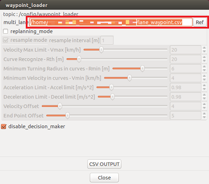  
ファイルを指定したら、Computing タブ内の waypoint_loader のチェックボックスにチェックを入れます。  

(2) vel_pose_connect の app をクリックして、「Simulation Mode」にチェックを入れます。  
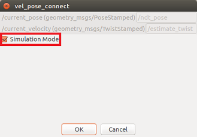  
Simulation Mode 設定後、Computing タブ内の vel_pose_connect のチェックボックスにチェックを入れます。    

(3) wf_simulator の app をクリックして、「Initialize Source」を「Rviz」に設定します。  
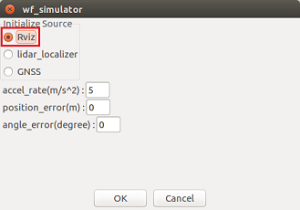  
「Initialize Source」を「Rviz」に設定後、Computing タブ内の wf_simulator のチェックボックスにチェックを入れます。

(4) lane_rule、lane_stop、lane_select、obstacle_avoid、velocity_set、twist_filter、wf_simulator のチェックボックスにチェックを入れて、これらのノードを起動します。
設定後の Computing タブは下図のようになります。  
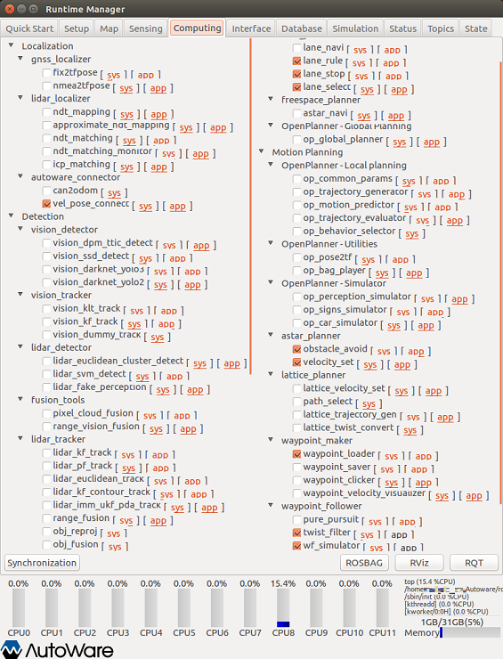

## 6. MATLAB から Autoware（ROS マスター）への接続
MATLAB で rosinit コマンドを使用して ROS マスターに接続します。
rosinit の引数はご自身の環境に合わせて設定してください。
```MATLAB
rosinit();
```  
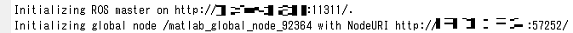

## 7. Simulink で作成した pure_pursuit を起動
pure_pursuit の Simulink モデルがあるフォルダをMATLAB検索パスに登録後、pure_pursuit の Simulink モデルを開きます。
```MATLAB
pure_pursuit_folder = fullfile(autoware.getRootDirectory(), ...
                        'benchmark', 'computing', 'planning', 'motion', 'waypoint_follower', 'pure_pursuit');
addpath(pure_pursuit_folder);
model = 'pure_pursuit_sl';
open_system(model);
```  
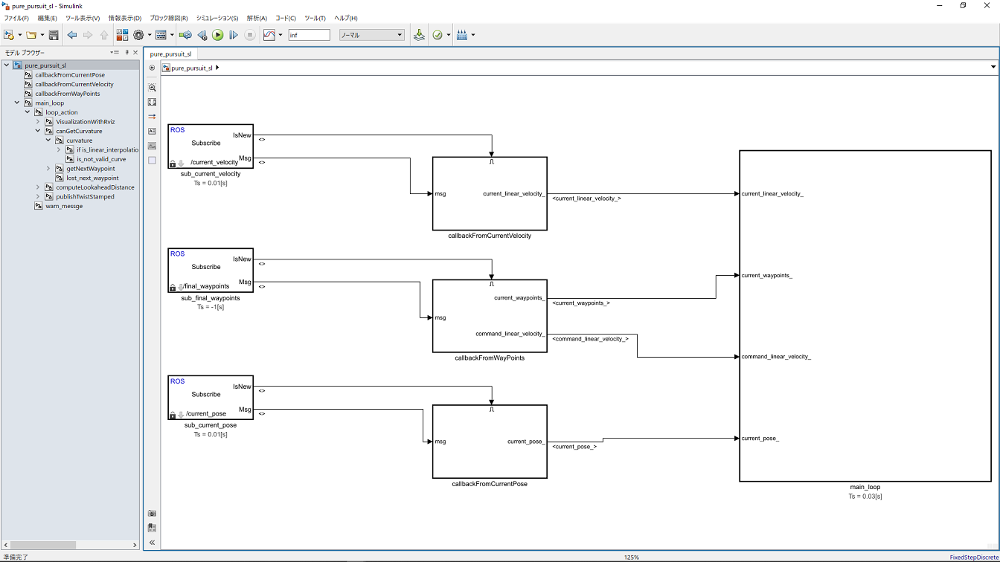
 
## 8. Simulink で作成した pure_pursuit を実行
pure_pursuit の Simulink モデルを実行します。  
```MATLAB
set_param(model, 'SimulationCommand', 'Start');
```

## 8. rviz で車両の初期位置を設定
 (1) rviz の「2D Pose Estimate」をクリックします。
 (2) その後、車両の初期位置から移動方向にマウスドラッグして矢印を設定します。


<html><br></html>

## 9. 経路追従の開始
rviz で初期位置を設定後しばらくすると、経路追従が始まります。  


本例実行時のノードグラフを確認するには 
[ここ](./images/pure_pursuit/rosgraph_pure_pursuit.png) をクリックしてください。
pure_pursuit_sl で生成されたノードは /pure_pursuit_sl_81473 です。

## 10. 終了処理
下記のコマンドを実行して終了します。  
```MATLAB
set_param(model, 'SimulationCommand', 'Stop');
close_system(model);
rosshutdown();
rmpath(pure_pursuit_folder);
clear('model', 'pure_pursuit_folder');
```
---
## Demo Video
[](https://youtu.be/C1ay6RXpXGo)